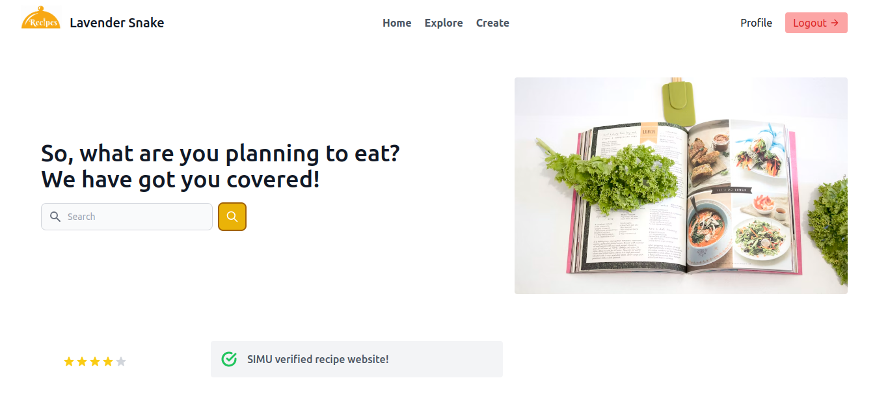
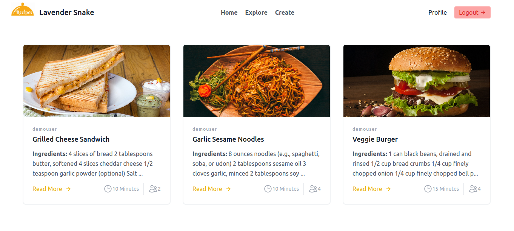

# lavender-snake-recipe

## Screenshots
**Home Page Section** 

**Explore Page Section** 

### Quick development environment
1. Create .env file in root directory.

2. Copy content from template.env to .env

3. Build and start docker container
	linux:
	>sudo docker-compose up --build

4. Visit 0.0.0.0:8000 in browser